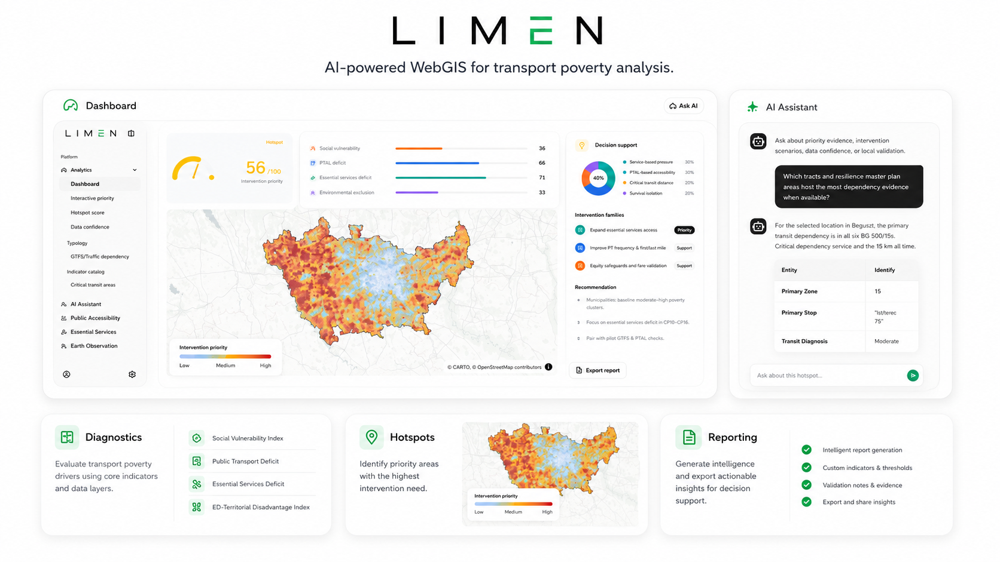
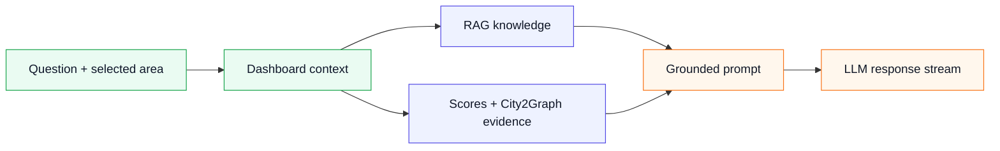

<p align="center">
  
</p>

<p align="center">
  AI-powered WebGIS for Milan transport poverty analysis.<br />
  Diagnose vulnerable areas, compare accessibility gaps, and rank intervention priorities.
</p>

<p align="center">
  
  
  
  
  
  
  
</p>


## Features

- Interactive Milan WebGIS dashboard powered by MapLibre.
- Transport poverty analysis across social vulnerability, public transport deficit, essential services, and Earth Observation context.
- Hotspot score, intervention priority index, data confidence, and typology layers.
- Optional LLM assistant for evidence explanation and report-style interpretation.
- Docker-ready production deployment with local GeoJSON data served through Next.js API routes.

<p align="center">
  
</p>

## AI Assistant

The AI assistant turns selected map data into readable planning guidance. It can explain why a hotspot is critical, summarize dominant drivers, data confidence, suggest validation needs, formula and explain how the score is calculated.



<p align="center">
  
</p>

## Quick Start

```bash
npm install
npm run dev
```

Or start the Docker stack:

```bash
docker compose up --build
```

## Environment

Create a local development env file:

```bash
cp .env.example .env.local
```

Example values:

```env
NEXT_PUBLIC_GOOGLE_MAPS_EMBED_API_KEY=your-google-maps-embed-key
LLM_BASE_URL=https://api.openai.com/v1
LLM_API_KEY=your-server-side-llm-api-key
LLM_MODEL=gpt-5-mini
LLM_TEMPERATURE=0.2
LLM_MAX_TOKENS=1200
```

For Docker Compose, create `.env` in the project root:

```bash
cp .env.example .env
```
Then fill in the same values and rebuild:

```bash
docker compose up --build
```
Notes:

- Leave the Google Maps key empty if you do not need the embedded basemap.
- Leave `LLM_API_KEY` empty if you do not need the server-backed `Default` AI assistant.
- After changing `NEXT_PUBLIC_GOOGLE_MAPS_EMBED_API_KEY`, rebuild because `NEXT_PUBLIC_*` values are build-time browser variables.
- After changing only `LLM_*`, restarting the container is enough because those values are runtime server variables.

| Variable | Used for | Required |
| --- | --- | --- |
| `NEXT_PUBLIC_GOOGLE_MAPS_EMBED_API_KEY` | Google Maps embedded basemap. This value is public and bundled during build. | Optional |
| `LLM_BASE_URL` | Server-side API base URL for the built-in `Default` AI provider. | Optional unless overriding the default endpoint |
| `LLM_API_KEY` | Server-side API key used by the built-in `Default` AI provider. Keep this private. | Required for server-side Default AI |
| `LLM_MODEL` | Server-side model used by the built-in `Default` AI provider. | Optional unless overriding the default model |
| `LLM_TEMPERATURE` | Server-side answer stability for the AI assistant. Lower values keep responses stable. | Optional |
| `LLM_MAX_TOKENS` | Maximum response length from the server-side LLM call. | Optional |

The `LLM_*` values configure the server-backed `Default` AI provider. In the dashboard UI, `Default` is locked and cannot be edited there. Users can still choose another provider in the UI and enter a browser-side base URL, model, and API key for their local session.
## Structure

```text
data/       GIS layers and analysis context
doc/image/  README images
public/     static images and public assets
scripts/    data and standalone build helpers
src/        Next.js app, components, APIs, and utilities
tests/      regression checks
```
